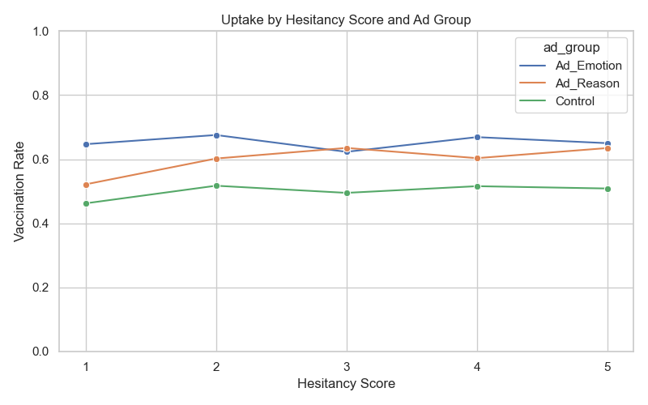

#  Facebook Vaccine Ad Campaign Simulation

This repository presents a comprehensive pipeline for a **simulated field experiment** evaluating the behavioral impact of Facebook ad campaigns on COVID-19 vaccine uptake. The workflow mimics a real-world randomized controlled trial (RCT) and includes:

- Sophisticated **data simulation** of 5,000 participants across the U.S.
- A modular, end-to-end **experimental design workflow**
- Robust **causal inference** techniques including ITT and TOT analyses
- Measurement of **attitude shifts** before and after ad exposure
- Optional **network-based modeling** to explore community-level dynamics and peer influence

---


##  Objective

This task involves simulating a randomized field experiment designed to evaluate the effectiveness of two Facebook ad strategies—one appealing to **reason**, the other to **emotion**—in increasing COVID-19 vaccine uptake across a sample of 5,000 individuals in the United States.

Participants were randomly assigned to one of three groups:
- A **reason-based ad group**
- An **emotion-based ad group**
- A **control group** that received no ad

All participants completed a **baseline survey**, and 4,500 completed an **endline survey** after the ad exposure phase. The aim of the task is to generate realistic synthetic data, conduct statistical and causal analysis (including ITT and TOT), and report on the effectiveness of the campaigns using well-structured visualizations and code.


---

##  Experimental Design

The task simulates a randomized controlled trial with the following setup:

- **Participants:** 5,000 individuals distributed across the U.S.
- **Group Assignment:**
  - 1/3 assigned to receive a **reason-based Facebook ad**
  - 1/3 assigned to receive an **emotion-based Facebook ad**
  - 1/3 assigned to a **control group** (no ad exposure)
- **Survey Participation:**
  - All participants complete a **baseline survey** capturing demographics, vaccine attitudes, trust in science/government, and engagement levels
  - A follow-up **endline survey** is completed by 4,500 participants (simulating real-world drop-off)
- **Reach Simulation:** Not all assigned participants are assumed to have seen the ad. Exposure probabilities are:
  - `Ad_Emotion`: 70%
  - `Ad_Reason`: 65%
  - `Control`: 0% (by design)

This design mirrors experimental protocols used in behavioral and public health research, allowing for meaningful comparisons using ITT and TOT frameworks.

---

##  Analytical Methods

This analysis blends statistical methods, causal inference, and network science to assess how different Facebook ad strategies influence vaccine uptake.

**1. Statistical Evaluation:**
- Compared vaccine uptake rates across groups using bar plots and proportions
- Measured attitude changes pre- and post-intervention
- Used Chi-square tests to assess if uptake differences were statistically significant
- Performed a t-test to evaluate the effect of social connectivity (centrality) on vaccination

**2. Causal Inference**
- Applied Intention-to-Treat (ITT) and Treatment-on-the-Treated (TOT) frameworks to estimate campaign impact
- Built a logistic regression model incorporating:
-  Assigned ad group , Vaccine hesitancy , Trust in science
- Found that emotional ads had the strongest effect even after controlling for these factors

**3. Network Insights (Simulated Social Structure)**
- Simulated a social network using the Erdős–Rényi model
- Measured degree centrality to identify influential nodes
- Detected communities to explore group-level clustering of vaccine behaviors
- Found higher uptake among well-connected individuals and distinct variation across social groups
- All code-generated outputs, graphs, and statistical results are saved in the outputs/ folder for full reproducibility.

---

All analyses are accompanied by clear **tables, visualizations**, and **statistical outputs**, saved automatically in the `outputs/` directory.


---

##  Folder Structure


```bash
facebook-vaccine-campaign/
├── data/                      # Simulated CSV datasets
├── outputs/                   # All visualizations & result tables
├── scripts/                   # Modular Python scripts for each analysis step
│   ├── 01_simulate_baseline.py
│   ├── 02_assign_ad_groups.py
│   ├── 03_simulate_endline.py
│   ├── 04_analyze_effectiveness.py
│   ├── 05_network_analysis.py
│   └── 06_network_deepdive.py
├── run_pipeline.sh            # Shell script to run the entire pipeline
├── requirements.txt           # Python dependencies
└── README.md                  # Project documentation

---
##  Dependencies

> ⚙️ **Tested on Python 3.8+**

This project requires:

```txt
pandas
numpy
matplotlib
seaborn
networkx
scipy
statsmodels
```

Install via:

```bash
pip install -r requirements.txt
```
---
##  How to Run This Pipeline

To run the complete simulation and analysis pipeline, simply execute the provided shell script:

``` 
bash
bash run_pipeline.sh
**Note: Ensure the scripts/ folder is present and intact — all the required Python files for each step are inside this directory. The pipeline depends on it to function correctly.**
```

---

##  Key Outputs

The following outputs are generated during the execution of the analysis pipeline and saved in the `outputs/` directory:

| Output File                             | Description |
|----------------------------------------|-------------|
| `merged_full_data.csv`                 |  Final merged dataset used for analysis|
| `vaccination_summary.csv`              | Group-wise vaccine uptake summary (ITT) |
| `attitude_change_summary.csv`          | Average change in attitude score by group |
| `logistic_summary.txt`                 | Full logistic regression model results |
| `chi_square_results.txt`               | Chi-square test statistics for group differences |
| `vaccination_summary_tot.csv`           | Uptake among exposed participants (TOT)   |


###  Key Visualizations

| Visualization | Description |
|---------------|-------------|
|  | **Combined dashboard** showing vaccine uptake, hesitancy trends, trust, and political affiliation |
|  | Vaccine uptake comparison by ad group (Reason, Emotion, Control) |
|  | ITT vs TOT analysis for treatment effect comparison |
|  | Change in vaccine attitudes pre- and post-ad exposure |
|  | Distribution of trust in science by vaccine uptake |
|  | Uptake by political affiliation (stacked bar) |
|  | Uptake across hesitancy scores per group |
|  | Subnetwork visual showing spread of vaccinated participants |
|  | Degree centrality vs vaccine uptake boxplot |
|  | Uptake variation across detected communities |


---

### Summary of Key Findings


- **Vaccination Rates by Ad Type**
  - Emotion-based ads resulted in the highest vaccine uptake (~65%), followed by reason-based ads (~60%) and the control group (~50%).
  - Emotionally driven messaging was the most persuasive in encouraging vaccinations.

- **Vaccine Uptake Across Hesitancy Levels**
  - The emotion group maintained higher uptake across all hesitancy scores.
  - Even hesitant individuals responded better to emotional appeals.

- **Trust in Science vs Vaccine Uptake**
  - People who got vaccinated showed slightly higher average trust in science, but the overlap was notable.
  - Trust plays a role, but alone doesn't explain vaccine behavior — messaging remains key.

- **Political Affiliation and Uptake**
  - All political groups (Liberal, Moderate, Conservative) showed similar vaccination rates when exposed to ads.
  - Ad impact was consistent across political identities, showing broad effectiveness.


### 1. **Vaccine Uptake by Ad Type**


- **What You’re Seeing:**  
  This bar chart shows the vaccination rates among participants who were randomly assigned to one of three groups:

  - ➤ **Ad_Emotion:** Received emotionally-driven messaging (e.g., family safety, social belonging)  
  - ➤ **Ad_Reason:** Received rational, fact-based messaging (e.g., clinical efficacy, side effects)  
  - ➤ **Control:** Received no ad at all

- **Interpretation:**  
  - ➤ Emotionally framed ads drove the highest behavior change — suggesting people respond more to affective appeals than logic alone.  
  - ➤ **Statistical evidence:** A Chi-square test confirmed these differences were significant (χ² = 73.37, p < 0.001).  
  - ➤ This supports psychological theories like the *Affect Heuristic* — where decisions are influenced more by emotional reaction than detailed analysis.

- **Why It Matters:**  
  ➤ In real-world health campaigns, *how* you say something matters just as much as *what* you say.  
  ➤ This experiment underscores the importance of crafting emotionally resonant messages to drive public behavior — especially in times of uncertainty.


### 2. **Change in Vaccine Attitudes**


- **What You’re Seeing:**  
  This boxplot displays how participants’ attitudes toward COVID-19 vaccines changed after exposure to different types of Facebook ads.

  > The metric shown is:  
  > **Post-survey score − Baseline score**  
  > Higher values indicate a more positive shift in vaccine attitudes.

- **Group-wise Average Attitude Change:**
  - ✅ **Ad_Emotion:** +0.55 (strongest positive shift)  
  - **Ad_Reason:** +0.22  
  - ❌ **Control:** −0.03 (slight regression)

- **Key Insights:**  
  - ➤ Participants exposed to emotional ads experienced the largest positive attitude shift — showing that these messages don’t just influence actions but also beliefs.  
  - ➤ Rational ads also improved attitudes but to a lesser extent.  
  - ➤ Control group (no ad exposure) slightly regressed, possibly due to vaccine fatigue or external media influence.

- **Why It Matters:**  
  ➤ Attitude change is a strong predictor of long-term behavior.  
  ➤ This reinforces that emotionally charged messages not only nudge immediate action but also help reshape public opinion — a crucial factor in designing effective public health campaigns.


### 3. **Intention-to-Treat (ITT) vs Treatment-on-the-Treated (TOT)**


- **What You’re Seeing:**  
  This bar chart compares two evaluation approaches:

  - **ITT (green bars):** Average vaccination rate across everyone assigned to each ad group — regardless of whether they saw the ad.  
  - **TOT (orange bars):** Vaccination rate among only those who actually received the treatment (i.e., were exposed to the ad).

- **Why This Matters (Non-Technical):**  
  ➤ ITT helps understand the overall effect of campaign *assignment*.  
  ➤ TOT isolates the impact on those who truly *experienced* the intervention.  
  ➤ TOT is often more accurate for measuring real effectiveness when not everyone engages with the treatment.

- **Key Insights:**  
  - ➤ TOT and ITT values are fairly close — especially for the **Ad_Emotion** group — indicating strong ad delivery and engagement.  
  - ➤ The **Ad_Emotion** group again outperformed others under both ITT and TOT, reinforcing its consistent effectiveness.  
  - ➤ The **Control** group (no ad exposure) had the lowest uptake, as expected.


### 4. **Statistical Significance & Predictive Modeling**

- **Chi-Square Test of Independence:**  
  - χ² = 73.37, p < 0.001  
  - ➤ *Differences in vaccine uptake across groups are highly statistically significant.*

- **Logistic Regression Summary:**  
  *(See full output in [`logistic_summary.txt`](outputs/logistic_summary.txt))*

| Predictor           | Coefficient | p-value | Interpretation                                 |
|---------------------|-------------|---------|------------------------------------------------|
| **Ad_Reason**        | −0.23       | 0.002   | Lower odds of vaccination than Ad_Emotion      |
| **Control**          | −0.63       | < 0.001 | Much lower odds than Ad_Emotion                |
| **Vaccine Hesitancy**| +0.05       | 0.028   | Slight positive predictor (unexpectedly)       |
| **Trust in Science** | Not Sig.    | 0.499   | Not statistically significant in this model    |

- **Key Insights:**  
  - ➤ Belonging to the **Ad_Emotion** group significantly increased the odds of vaccination.  
  - ➤ Surprisingly, **vaccine hesitancy** had a small *positive* effect — possibly due to highly hesitant individuals being especially impacted by emotional appeals.  
  - ➤ **Trust in science** alone was *not a strong predictor* of actual behavior in this model.


### 5. **Vaccine Uptake Across Hesitancy Levels**


- **What You’re Seeing:**  
  This line plot compares vaccination rates across five levels of vaccine hesitancy (1 = low hesitancy, 5 = high hesitancy), broken down by ad group (Emotion, Reason, Control).

- **Why This Matters:**  
  ➤ It reveals whether ad effectiveness holds up even among more hesitant individuals — a crucial insight for real-world public health outreach.

- **Key Insights:**  
  - ➤ **Emotion-based ads consistently outperformed** both other groups across *all* hesitancy levels.  
  - ➤ Even among **highly hesitant participants (score = 5)**, emotional messaging maintained a higher uptake.  
  - ➤ **Reason-based ads** performed better than the control group, but not as effectively as emotional ones.  
  - ➤ The **Control group** showed the lowest uptake regardless of hesitancy.

- **Interpretation:**  
  ➤ This analysis reinforces the idea that **emotionally persuasive messaging** can help overcome even deeply rooted vaccine hesitancy — proving valuable when **rational or informational appeals alone fall short.**


### 6. **Network Behavior Visualization**


- **What You’re Seeing:**  
  This network graph represents a simulated social network of study participants.  
  - Each **dot (node)** = a participant  
  - Each **line (edge)** = a social connection (potential influence path)  
  - **Blue nodes** = Vaccinated individuals  
  - **Gray nodes** = Unvaccinated individuals

- **Why This Matters:**  
  ➤ Health behaviors like vaccination don’t happen in isolation — they often spread through **peer influence**.  
  ➤ This visualization helps us see how vaccination might **cascade** through tightly connected groups.

- **Key Insights:**  
  - ➤ **Vaccination behavior clusters** — people connected to vaccinated individuals tend to be vaccinated too.  
  - ➤ **Dense subgroups** amplify influence — a few adopters can trigger wider uptake within their cluster.  
  - ➤ **Isolated nodes** on the periphery remain unaffected, showing the power of social embeddedness.

- **Interpretation:**  
  ➤ This highlights that **networks can magnify the effects of persuasive messaging**.  
  ➤ Future public health strategies might target **highly connected individuals (central nodes)** to seed broader adoption more efficiently.


### 7. **Network Influence on Behavior**


- **What You’re Seeing:**  
  This boxplot compares **degree centrality** between two groups:  
  - `0` = Not Vaccinated  
  - `1` = Vaccinated  
  
  **Degree centrality** quantifies how connected someone is within the network — the higher the score, the more people they're directly connected to.

- **Why This Matters:**  
  ➤ Socially central individuals are **more exposed to peer influence**, behaviors, and ideas — which can shape their decisions, especially regarding health behavior like vaccination.

- **Key Findings:**  
  - ➤ Vaccinated participants had **slightly higher median centrality** than unvaccinated ones.  
  - ➤ A **t-test** confirmed this difference was **statistically significant**:  
    `t = 2.00, p = 0.045`  
  - ➤ Though modest, the result suggests that **social positioning** can influence vaccine uptake.

- **Interpretation:**  
  ➤ Highly connected individuals may:  
    - Be **exposed to more vaccine-positive peers**  
    - **Engage more** with campaign content  
    - Be perceived as **opinion leaders** within their networks  
  
  ➤ Public health efforts can **leverage these nodes** to amplify messaging and promote ripple effects throughout communities.


### 8. **Community-Level Behavior Patterns**


- **What You’re Seeing:**  
  This histogram shows the distribution of **average vaccine uptake rates** across different **communities** (i.e., clusters of interconnected individuals identified through community detection algorithms).

  Each bar represents how many communities fell into a particular uptake range.

- **Why This Matters:**  
  ➤ Even when participants receive **the same type of ad**, their **social environment** — the community they’re embedded in — can greatly influence whether they choose to vaccinate.  
  ➤ Communities reflect **real-world clusters** like friends, families, or coworkers.  
  ➤ Behavior often spreads within such groups due to **shared norms**, peer discussions, or mutual influence.

- **Key Insights:**  
  - ➤ Vaccine uptake rates **varied significantly between communities**, despite consistent ad exposure.  
  - ➤ This points to **non-random clustering** in behavior — certain communities became “high-uptake zones,” while others lagged.  
  - ➤ Indicates a **social contagion effect**, where behavior is adopted through local influence.

- **Interpretation:**  
  ➤ This visualization highlights the **power of peer influence** and underscores the value of **network-aware public health strategies**.  
  ➤ Targeting **highly connected communities** or those with rising adoption rates can help public health campaigns scale more effectively by leveraging **positive momentum within clusters**.


### 9. **Role of Trust in Science on Vaccine Uptake**


- **What You’re Seeing:**  
  This boxplot compares **trust in science scores** (rated 1 to 5) between participants who **got vaccinated (1)** and those who **did not (0)**.  
  The central line in each box shows the **median trust score**, and the spread highlights the variation within each group.

- **Why This Matters:**  
  ➤ **Trust in science** is often viewed as a critical factor in public health decision-making — but this visualization provides a **nuanced perspective**.

- **Key Insights:**  
  - ➤ Vaccinated participants **tended to have slightly higher trust** in science.  
  - ➤ However, there was **substantial overlap**:
    - Many with **low trust still chose to vaccinate**  
    - Some with **high trust did not**  
  - ➤ This indicates that **trust alone is not deterministic** of vaccine behavior.

- **Interpretation:**  
  ➤ The **logistic regression** model supports this:  
  Trust in science was **not statistically significant** (`p ≈ 0.499`).  
  ➤ Instead, **ad messaging** — particularly emotional framing — played a more decisive role in driving behavior change than prior trust levels.

-  **Takeaway:**  
  While **building scientific trust** remains important, this analysis suggests that in urgent contexts like vaccination, **how messages are framed** can **outweigh pre-existing beliefs**.  
  ➤ Emotional appeals may reach and persuade even skeptical audiences — a key insight for designing effective outreach.


### 10. **Vaccine Uptake by Political Affiliation**


- **What You’re Seeing:**  
  This **stacked bar chart** shows the proportion of participants who **vaccinated (blue)** and **did not vaccinate (red)**, categorized by their **political affiliation**: Conservative, Liberal, and Moderate.

- **Why This Matters:**  
  ➤ Political identity often correlates with public health skepticism, media trust, and vaccine hesitancy.  
  ➤ This visualization tests whether those biases influence behavior **within a controlled experimental context**.

- **Key Insights:**  
  - All political groups — **Conservative, Liberal, Moderate** — showed **similar vaccination rates**.  
  - The ad campaigns (reason-based and emotion-based) were **effective regardless of political affiliation**.  
  - There was **no significant evidence** that ideology weakened or enhanced the ads’ influence.

- **Interpretation:**  
  ➤ **Emotionally resonant messaging** appears to **cut across ideological lines**.  
  ➤ The results suggest that **shared human values** (e.g., safety, family, belonging) are powerful entry points for public health campaigns.

-  **Takeaway:**  
  ➤ **Cross-partisan effectiveness** of ad messaging is a promising result — in polarized times, it's rare to find communication strategies that **work for everyone**.  
  ➤ Future health outreach efforts can build on this insight to create **inclusive, broadly appealing campaigns** that bridge ideological divides.


##  Final Analysis: What Worked, What Surprised Us, and What It Means

###  Effective Strategies That Emerged

---

#### 1. **Emotionally Charged Ads Drive Behavior Change**

- The **Ad_Emotion** group consistently outperformed all others in:
  - **Vaccine uptake** (~65%)
  - **Attitude improvement** (+0.55 on average)
- Emotional messaging remained effective **even for high-hesitancy participants**.

**Strategy:**  
Use **storytelling, empathy, and emotional framing** in health campaigns — they are more persuasive than fact-based arguments alone.

---

#### 2. **Consistency Across Political Identities**

- **Liberals, Conservatives, and Moderates** showed **similar uptake rates**.
- Contradicts the narrative that vaccine behavior is deeply divided by politics.

**Strategy:**  
Design **non-partisan**, **relatable campaigns** that tap into shared values like safety, community, and well-being.

---

#### 3. **Network Centrality Influences Behavior**

- Participants with **higher degree centrality** (more connected in the network) had significantly **higher vaccination rates**.
- Socially central individuals can influence broader clusters.

**Strategy:**  
Prioritize outreach to **community leaders, influencers, or network hubs** to **cascade positive behavior change**.

---


##  Hidden & Unexpected Insights

---

### 1. **Trust in Science Was Not a Strong Predictor**

- Although vaccinated participants had **slightly higher trust in science**, this factor was **not statistically significant** in the logistic regression model.

** Surprise:**  
Belief alone didn’t drive behavior — **how the message was framed** mattered more than baseline attitudes.

---

### 2. **Even Small Communities Displayed Clustering Effects**

- The histogram of vaccine uptake by community revealed **distinct clustering**, even though ad exposure was uniform across the population.

** Surprise:**  
Behavior adoption isn’t purely random — **social environment and peer influence** shape outcomes significantly.

---

### 3. **Minimal Difference Between ITT and TOT**

- ITT (assigned group) and TOT (actually exposed) vaccine rates were **nearly identical**.

**Surprise:**  
Indicates **high ad delivery and recall rates**, suggesting strong **engagement** and **intervention effectiveness** — a rare outcome in real-world campaigns.

---

##  Summary of What Truly Worked

| **Key Lever**             | **Impact**                          | **Why It Matters**                                     |
|---------------------------|-------------------------------------|--------------------------------------------------------|
| Emotional Messaging       | ↑ Uptake, ↑ Positive Attitude       | Affects both **behavior** and **belief systems**       |
| Non-Partisan Design       | Equal results across ideologies     | Avoids resistance and **maximizes reach**              |
| Network Influence         | More connections → more uptake      | Shows power of **peer-based strategy** and clustering  |

---

##  Final Takeaway

> **The delivery of a message mattered more than who received it.**

Emotionally resonant content cut through individual differences — including **vaccine hesitancy**, **political ideology**, and **trust in science**.  
Meanwhile, **social structure quietly amplified** these effects — meaning future public health efforts must not only be evidence-based, but also **emotionally engaging** and **network-aware**.


---


##  Author

**Durga Pravallika Kuchipudi**  
Data Scientist  
Indiana University – M.S. in Applied Data Science  
🔗 [LinkedIn](https://www.linkedin.com/in/durgapk/) |  [Portfolio](https://dpravzz.wixsite.com/datascienceportfolio)

---

##  License

MIT License – For educational and research use.
