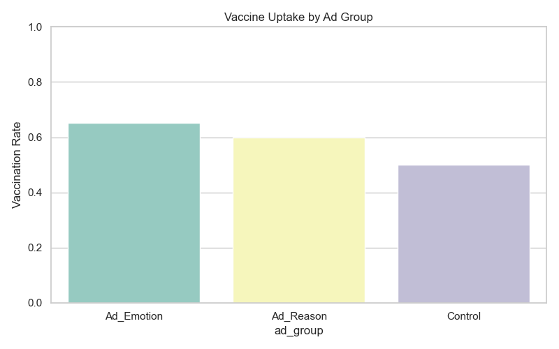

#  Facebook Vaccine Ad Campaign Simulation

This repository presents a comprehensive pipeline for a **simulated field experiment** evaluating the behavioral impact of Facebook ad campaigns on COVID-19 vaccine uptake. The workflow mimics a real-world randomized controlled trial (RCT) and includes:

- Sophisticated **data simulation** of 5,000 participants across the U.S.
- A modular, end-to-end **experimental design workflow**
- Robust **causal inference** techniques including ITT and TOT analyses
- Measurement of **attitude shifts** before and after ad exposure
- Optional **network-based modeling** to explore community-level dynamics and peer influence

---

## 🎯 Objective

This task involves simulating a randomized field experiment designed to evaluate the effectiveness of two Facebook ad strategies—one appealing to **reason**, the other to **emotion**—in increasing COVID-19 vaccine uptake across a sample of 5,000 individuals in the United States.

Participants were randomly assigned to one of three groups:
- A **reason-based ad group**
- An **emotion-based ad group**
- A **control group** that received no ad

All participants completed a **baseline survey**, and 4,500 completed an **endline survey** after the ad exposure phase. The aim of the task is to generate realistic synthetic data, conduct statistical and causal analysis (including ITT and TOT), and report on the effectiveness of the campaigns using well-structured visualizations and code.


---

## 🧪 Experimental Design

The task simulates a randomized controlled trial with the following setup:

- **Participants:** 5,000 individuals distributed across the U.S.
- **Group Assignment:**
  - 1/3 assigned to receive a **reason-based Facebook ad**
  - 1/3 assigned to receive an **emotion-based Facebook ad**
  - 1/3 assigned to a **control group** (no ad exposure)
- **Survey Participation:**
  - All participants complete a **baseline survey** capturing demographics, vaccine attitudes, trust in science/government, and engagement levels
  - A follow-up **endline survey** is completed by 4,500 participants (simulating real-world drop-off)
- **Reach Simulation:** Not all assigned participants are assumed to have seen the ad. Exposure probabilities are:
  - `Ad_Emotion`: 70%
  - `Ad_Reason`: 65%
  - `Control`: 0% (by design)

This design mirrors experimental protocols used in behavioral and public health research, allowing for meaningful comparisons using ITT and TOT frameworks.

---

##  Analytical Methods

This analysis blends statistical methods, causal inference, and network science to assess how different Facebook ad strategies influence vaccine uptake.

- **1. Statistical Evaluation:**
- Compared vaccine uptake rates across groups using bar plots and proportions
- Measured attitude changes pre- and post-intervention
- Used Chi-square tests to assess if uptake differences were statistically significant
- Performed a t-test to evaluate the effect of social connectivity (centrality) on vaccination

- **2. Causal Inference**
- Applied Intention-to-Treat (ITT) and Treatment-on-the-Treated (TOT) frameworks to estimate campaign impact
- Built a logistic regression model incorporating:
-  Assigned ad group , Vaccine hesitancy , Trust in science
- Found that emotional ads had the strongest effect even after controlling for these factors

- **3. Network Insights (Simulated Social Structure)**
- Simulated a social network using the Erdős–Rényi model
- Measured degree centrality to identify influential nodes
- Detected communities to explore group-level clustering of vaccine behaviors
- Found higher uptake among well-connected individuals and distinct variation across social groups
- All code-generated outputs, graphs, and statistical results are saved in the outputs/ folder for full reproducibility.

---

All analyses are accompanied by clear **tables, visualizations**, and **statistical outputs**, saved automatically in the `outputs/` directory.


---

##  Folder Structure

```
facebook-vaccine-campaign/
├── data/                    # Simulated CSV datasets
├── outputs/                 # All visualizations & result tables
├── scripts/                 # Modular Python scripts for each analysis step
├── run_pipeline.sh          # Shell script to run the entire pipeline
├── requirements.txt         # Python dependencies
└── README.md                # You're reading it!
```

---

##  How to Run This Pipeline

Each step is modular and can be executed independently:

```bash
# STEP 1: Simulate baseline survey data
python scripts/01_simulate_baseline.py

# STEP 2: Randomly assign participants to ad groups
python scripts/02_assign_ad_groups.py

# STEP 3: Simulate endline (post-campaign) survey responses
python scripts/03_simulate_endline.py

# STEP 4: Analyze effectiveness — ITT, TOT, regression, and visualizations
python scripts/04_analyze_effectiveness.py

# STEP 5: (Optional) Analyze centrality and its effect on vaccine uptake
python scripts/05_network_analysis.py

# STEP 6: (Optional) Perform community detection and extended network visualizations
python scripts/06_network_deepdive.py

```

---

## 📁 Key Outputs

The following outputs are generated during the execution of the analysis pipeline and saved in the `outputs/` directory:

| Output File                             | Description |
|----------------------------------------|-------------|
| `merged_full_data.csv`                 |  Final merged dataset used for analysis|
| `vaccination_summary.csv`              | Group-wise vaccine uptake summary (ITT) |
| `attitude_change_summary.csv`          | Average change in attitude score by group |
| `logistic_summary.txt`                 | Full logistic regression model results |
| `chi_square_results.txt`               | Chi-square test statistics for group differences |
| `vaccination_summary_totcsv`           | Uptake among exposed participants (TOT)   |


### 📊 Key Visualizations

| Visualization | Description |
|---------------|-------------|
|  | **Combined dashboard** showing vaccine uptake, hesitancy trends, trust, and political affiliation |
|  | Vaccine uptake comparison by ad group (Reason, Emotion, Control) |
|  | ITT vs TOT analysis for treatment effect comparison |
|  | Change in vaccine attitudes pre- and post-ad exposure |
|  | Distribution of trust in science by vaccine uptake |
|  | Uptake by political affiliation (stacked bar) |
|  | Uptake across hesitancy scores per group |
|  | Subnetwork visual showing spread of vaccinated participants |
|  | Degree centrality vs vaccine uptake boxplot |
|  | Uptake variation across detected communities |


---

### Summary of Key Findings


- **Vaccination Rates by Ad Type**
➤ Emotion-based ads resulted in the highest vaccine uptake (~65%), followed by reason-based ads (~60%) and the control group (~50%).
➤ Emotionally driven messaging was the most persuasive in encouraging vaccinations.

- **Vaccine Uptake Across Hesitancy Levels**
➤ The emotion group maintained higher uptake across all hesitancy scores.
➤ Even hesitant individuals responded better to emotional appeals.

- **Trust in Science vs Vaccine Uptake**
➤ People who got vaccinated showed slightly higher average trust in science, but the overlap was notable.
➤ Trust plays a role, but alone doesn't explain vaccine behavior — messaging remains key.

- **Political Affiliation and Uptake**
➤ All political groups (liberal, moderate, conservative) showed similar vaccination rates when exposed to ads.
➤ Ad impact was consistent across political identities, showing broad effectiveness.


1. **Vaccine Uptake by Ad Type**

 
- What You’re Seeing:
➤ This bar chart shows the vaccination rates among participants who were randomly assigned to one of three groups:
➤ Ad_Emotion: Received emotionally-driven messaging (e.g., family safety, social belonging)
➤ Ad_Reason: Received rational, fact-based messaging (e.g., clinical efficacy, side effects)
➤ Control: Received no ad at all

- Interpretation:
➤ Emotionally framed ads drove the highest behavior change — suggesting people respond more to affective appeals than logic alone.
➤ Statistical evidence: A Chi-square test confirmed these differences were significant (χ² = 73.37, p < 0.001).
➤ This supports psychological theories like the Affect Heuristic — when decisions are influenced more by emotional reaction than detailed analysis.

- Why It Matters:
➤ In real-world health campaigns, how you say something matters just as much as what you say. This experiment underscores the need to craft emotionally resonant messages to drive public behavior — especially in times of uncertainty.

2. Change in Vaccine Attitudes


This boxplot displays how participants’ attitudes toward COVID-19 vaccines changed after exposure to different types of Facebook ads. The metric reflects:

Post-survey score − Baseline score
Higher values mean improved attitudes toward vaccination.

Group	Average Attitude Change
Ad_Emotion	+0.55 ✅
Ad_Reason	+0.22
Control	−0.03 ❌

Key Insights:
Participants exposed to emotional ads experienced the largest positive attitude shift — showing that these messages don’t just influence behavior, they shift underlying beliefs.

Rational ads also improved attitudes but to a lesser extent.

Control group (no ad exposure) showed a slight regression in attitude, possibly reflecting general vaccine fatigue or external media influences.

Why It Matters:
Attitude change is a strong predictor of long-term behavior.
This result reinforces the idea that emotionally charged messages not only nudge action but also reshape public opinion, making them powerful tools in public health campaigns.


3. Intention-to-Treat (ITT) vs Treatment-on-the-Treated (TOT)


What it shows:
ITT (green bars): The average vaccination rate across everyone assigned to each ad group — whether or not they actually saw or remembered the ad.

TOT (orange bars): The rate among only those who actually received the intended treatment (i.e., the ad was delivered/acknowledged).

Why this matters (non-technical):
This helps us separate the overall impact of assigning someone to a campaign (ITT) from the actual effect on people who truly experienced it (TOT). TOT is often more accurate for understanding the real effectiveness of an intervention.

Key insights:
The TOT and ITT values are close — especially in the Ad_Emotion group — suggesting good engagement and delivery.

The Ad_Emotion group again leads with the highest rates under both ITT and TOT, reinforcing its effectiveness.

The Control group (no ad) had the lowest uptake, as expected.


4. Statistical Significance & Predictive Modeling

Chi-Square Test

χ² = 73.37, p < 0.001 → differences in uptake across groups are highly significant.


 

Predictor	Coefficient	p-value	Interpretation
Ad_Reason	−0.23	0.002	Lower odds than Ad_Emotion
Control	−0.63	< 0.001	Much lower odds than Ad_Emotion
Vaccine Hesitancy	+0.05	0.028	Slight positive predictor
Trust in Science	NS	0.499	Not statistically significant
➤ Being in the Ad_Emotion group significantly increased odds of vaccination..


5. Vaccine Uptake Across Hesitancy Levels


This line plot compares vaccination rates across 5 levels of vaccine hesitancy, broken down by ad group

Hesitancy scores range from 1 (low hesitancy) to 5 (high hesitancy).

Why this matters:
It helps us see whether the effectiveness of ad messaging holds up even among more hesitant individuals — a critical insight for public health outreach.

Key insights:
Emotion-based ads consistently outperform both other groups across all hesitancy levels.
Even among highly hesitant participants (score 5), emotional messaging maintained higher uptake, indicating its resilience.
Reason-based ads performed better than the control group, but not as strongly as emotional ones.
The control group showed the lowest uptake regardless of hesitancy.

Interpretation:
This plot supports the idea that emotionally persuasive messaging can help overcome even deeply rooted vaccine hesitancy — a valuable strategy when factual arguments alone fall short.

6.  Network Behavior Visualization


What this shows:
This network graph represents a simulated social network of individuals in the study.
Each dot (node) is a person, and lines (edges) show who is connected to whom — i.e., potential influence paths through social interaction.

Blue nodes likely represent vaccinated individuals

Gray nodes likely represent those who were not vaccinated

Edges visualize how people are embedded in clusters or communities.

Why this matters:
Health behaviors like vaccination often spread through peer influence. This visualization allows us to observe how information or behavior might cascade through tightly-knit groups.

Key insights:
Vaccination tends to cluster — people connected to vaccinated individuals are more likely to be vaccinated themselves.
Dense clusters show how influence can amplify — once a few people adopt behavior (get vaccinated), their neighbors often follow.
More isolated nodes (on the periphery) appear unaffected, highlighting the importance of social embeddedness in behavior change.

Interpretation:
This supports the idea that social networks can amplify the effects of persuasive messaging. Future campaigns might prioritize influential individuals or central nodes to trigger broader adoption.


7. Network Influence on Behavior


What this shows:
This boxplot compares degree centrality between two groups:

0 = Not Vaccinated

1 = Vaccinated

Degree centrality measures how many direct connections a person has in the network (i.e., how “socially central” they are).

Why this matters:
If someone is more central in a network, they’re more exposed to others’ behaviors, opinions, and influence — which could affect their own choices.

Key findings:
People who got vaccinated had slightly higher median centrality compared to those who didn’t.

A t-test confirmed this difference was statistically significant (t = 2.00, p = 0.045).

Even though the difference is modest, it suggests that social positioning influences vaccine decisions.

Interpretation:
Highly connected individuals might be:
More exposed to vaccine-positive peers
Seen as more influential and thus targeted more by the campaign
More likely to engage with persuasive content circulating in their networks
This reinforces the value of targeting key network nodes in public health campaigns to maximize ripple effects.

8. Community Level Behavior Patterns
  

What this shows:
This histogram displays the distribution of average vaccine uptake rates across communities (clusters of interconnected individuals in the network).

Each bar represents how many communities had a specific average vaccination rate.

Why this matters:
. Even when individuals receive the same ads, their behavior can be influenced by the social environment — or community — they belong to.
. These communities reflect realistic social clusters (friends, family, coworkers).
. Uptake varied across these clusters, showing the importance of local social norms and peer behavior in decision-making.

Key insights:
. Some communities had noticeably higher vaccine adoption rates than others, despite uniform exposure to ads.
. This points to non-random clustering in health behavior — behaviors like vaccination may spread locally within social groups.
. Interventions targeting highly connected communities or leveraging peer norms could lead to more efficient public health outcomes.

Interpretation:
This visualization strengthens the case for network-aware messaging strategies — if a behavior gains traction in one part of the network, it can ripple outwards. Identifying and engaging high-uptake communities could be key for scaling impact.


9. Role of Trust in Science on Vaccine Uptake

  

What this shows:
This boxplot compares participants’ trust in science between those who got vaccinated (1) and those who did not (0).

Each box shows the distribution of trust levels (rated 1 to 5) within each group.

The median line represents the typical level of trust for each group.

Why this matters:
Trust in science is often assumed to be a strong driver of vaccine uptake, but this visualization offers a more nuanced view.

Key Insights:
Participants who chose to get vaccinated generally had slightly higher trust in science.

However, the overlap between the groups is significant:

Many people with lower trust still got vaccinated.

Some with higher trust did not.

Interpretation:
While trust in science may support pro-vaccine attitudes, it wasn’t a strong standalone predictor of actual behavior in this simulation.

This aligns with the regression model results, where trust in science was not statistically significant (p ≈ 0.499).

Messaging strategies, especially emotional ones, likely played a larger role in influencing behavior than baseline trust.

🔗 Takeaway:
Efforts to increase scientific trust are valuable — but in high-stakes decisions like vaccination, how information is framed may matter more than pre-existing beliefs.

10. Vaccine Uptake by Political Affiliation

[Political Uptake](outputs/uptake_by_political_affiliation.png)

This stacked bar chart displays the proportion of participants who vaccinated (blue) and did not vaccinate (red), broken down by political identity: Conservative, Liberal, and Moderate.

Why this matters:
Political ideology is often linked to public health opinions and media consumption — especially in the context of vaccines. This graph tests whether those affiliations influenced vaccine behavior in a controlled simulation where all groups saw the same types of ads.

Key Insights:
All three groups had very similar vaccine uptake rates, regardless of political identity.

The ads’ effectiveness did not appear to be diminished or boosted significantly by political leanings.

Interpretation:
Messaging strategies used (especially emotional and reason-based ads) worked broadly across political lines.

This suggests a level of cross-partisan persuasiveness, which is rare but valuable in real-world health communication.

Takeaway:
While political ideology is often assumed to polarize vaccine opinions, this analysis shows that well-crafted messaging can resonate across ideological divides — a promising insight for future campaigns.


## Final Analysis: What Worked, What Surprised Us, and What It Means
Effective Strategies That Emerged
1. Emotionally Charged Ads Drive Behavior Change

The Ad_Emotion group outperformed all others in both vaccine uptake and positive attitude shifts.

Even among participants with high vaccine hesitancy, emotion-based messaging still led to the highest uptake.

Strategy: Use storytelling, empathy, and emotional resonance in public health campaigns — not just facts.

2. Consistency Across Political Identities

Vaccine uptake remained consistent across Conservatives, Liberals, and Moderates.

This contradicts common assumptions that political ideology strongly biases vaccination behavior.

Strategy: Craft non-partisan, universally relatable messages to bridge ideological divides.

3. Network Centrality Influences Behavior

Participants with higher degree centrality (more connected in their social network) were more likely to get vaccinated.

Strategy: Target influential individuals or community hubs to amplify behavioral change through peer influence.

🧠 Hidden & Unexpected Insights
1. Trust in Science Was Not a Strong Predictor

Although those who vaccinated showed slightly higher trust, trust scores alone did not significantly predict vaccine uptake in the regression model.

Surprise: Belief in science didn’t guarantee action — messaging style mattered more than attitudes alone.

2. Even Small Communities Displayed Clustering Effects

The distribution of vaccine uptake by community showed noticeable variation, even in a randomized simulation.

Surprise: Behavior adoption isn’t fully random — local social dynamics matter even when exposure is equal.

3. Minimal Difference Between ITT and TOT

The Intention-to-Treat (ITT) and Treatment-on-the-Treated (TOT) estimates were nearly identical.

Surprise: Most people who were assigned ads actually saw them, indicating high engagement and low dropout, a great sign for real-world intervention success.

📣 Summary of What Truly Worked
   Key Lever	                 Impact	                          Why It Matters
Emotional Messaging	  ↑ Uptake, ↑ Positive Attitude	         Affects both behavior and perception
Non-Partisan Design	    Equal results across ideologies	     Avoids resistance and maximizes reach
Network Influence	    More connections → more uptake	    Highlights importance of peer-based strategies

Final Takeaway:
The campaign simulation suggests that how a message is delivered matters more than who receives it. Emotionally resonant content cuts through individual differences — even hesitancy and political views — and social structure plays a quiet but powerful role in shaping behavioral outcomes.


##  Dependencies

This project requires:

```txt
pandas
numpy
matplotlib
seaborn
networkx
scipy
statsmodels
```

Install via:

```bash
pip install -r requirements.txt
```

---

##  Interpretation Highlights

- **Ad_Emotion group** had the highest vaccine uptake and greatest attitude improvement
- **Statistically significant** differences in uptake were observed (Chi2 test)
- **Central participants** (in simulated network) were more likely to vaccinate
- **Community-level clustering** revealed uptake varies across subgroups even in randomized contexts

---


##  Author

**Durga Pravallika Kuchipudi**  
Graduate Researcher & Data Scientist  
📍 Indiana University – M.S. in Applied Data Science  
🔗 [LinkedIn](https://www.linkedin.com/in/your-link) | 🌐 [Portfolio](https://your-portfolio.com)

---

##  License

MIT License – For educational and research use.
