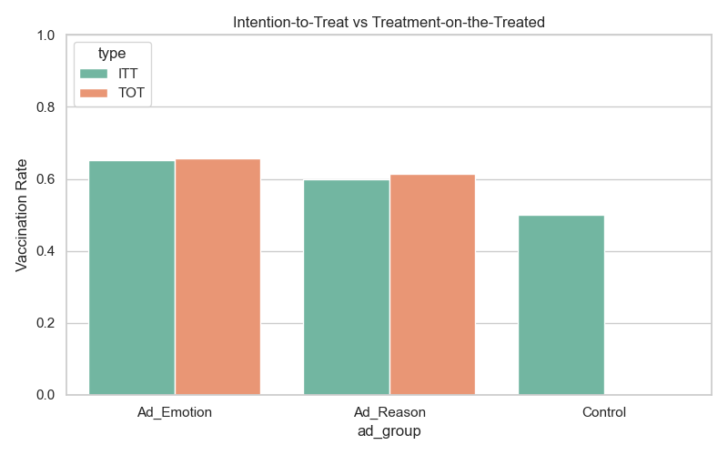

#  Facebook Vaccine Ad Campaign Simulation

This repository presents a comprehensive pipeline for a **simulated field experiment** evaluating the behavioral impact of Facebook ad campaigns on COVID-19 vaccine uptake. The workflow mimics a real-world randomized controlled trial (RCT) and includes:

- Sophisticated **data simulation** of 5,000 participants across the U.S.
- A modular, end-to-end **experimental design workflow**
- Robust **causal inference** techniques including ITT and TOT analyses
- Measurement of **attitude shifts** before and after ad exposure
- Optional **network-based modeling** to explore community-level dynamics and peer influence

---

## 🎯 Objective

This task involves simulating a randomized field experiment designed to evaluate the effectiveness of two Facebook ad strategies—one appealing to **reason**, the other to **emotion**—in increasing COVID-19 vaccine uptake across a sample of 5,000 individuals in the United States.

Participants were randomly assigned to one of three groups:
- A **reason-based ad group**
- An **emotion-based ad group**
- A **control group** that received no ad

All participants completed a **baseline survey**, and 4,500 completed an **endline survey** after the ad exposure phase. The aim of the task is to generate realistic synthetic data, conduct statistical and causal analysis (including ITT and TOT), and report on the effectiveness of the campaigns using well-structured visualizations and code.


---

## 🧪 Experimental Design

The task simulates a randomized controlled trial with the following setup:

- **Participants:** 5,000 individuals distributed across the U.S.
- **Group Assignment:**
  - 1/3 assigned to receive a **reason-based Facebook ad**
  - 1/3 assigned to receive an **emotion-based Facebook ad**
  - 1/3 assigned to a **control group** (no ad exposure)
- **Survey Participation:**
  - All participants complete a **baseline survey** capturing demographics, vaccine attitudes, trust in science/government, and engagement levels
  - A follow-up **endline survey** is completed by 4,500 participants (simulating real-world drop-off)
- **Reach Simulation:** Not all assigned participants are assumed to have seen the ad. Exposure probabilities are:
  - `Ad_Emotion`: 70%
  - `Ad_Reason`: 65%
  - `Control`: 0% (by design)

This design mirrors experimental protocols used in behavioral and public health research, allowing for meaningful comparisons using ITT and TOT frameworks.

---

##  Analytical Methods

This task incorporates both descriptive and inferential techniques to evaluate the effectiveness of the Facebook ad strategies. The analysis is structured into three key components:

---

### 1. Descriptive and Inferential Statistics

- **Vaccine uptake** rates calculated across the three groups

*Figure: Vaccine uptake across ad conditions (Reason, Emotion, Control).*
- **Pre- and post-attitude scores** analyzed to measure shifts in perception
- **Chi-square test** performed to determine whether differences in uptake are statistically significant across groups
- **T-test** conducted to assess whether participants with higher social connectivity (centrality) were more likely to vaccinate

---

### 2. Causal Modeling

- **Intention-to-Treat (ITT)** analysis: Estimates the impact of group assignment, regardless of exposure
- **Treatment-on-the-Treated (TOT)** analysis: Restricts analysis to only those exposed to the ad
- **Logistic regression** used to model the likelihood of vaccine uptake based on:
  - Assigned ad group
  - Vaccine hesitancy score
  - Trust in science

---

### 3. Network-Based Analysis (Optional Enhancement)

- **Erdős–Rényi social network** simulated across participants
- **Degree centrality** computed to model influence
- **Greedy modularity-based community detection** identifies clusters of participants
- **Community-level uptake** variation analyzed to explore social reinforcement effects

---

All analyses are accompanied by clear **tables, visualizations**, and **statistical outputs**, saved automatically in the `outputs/` directory.


---

##  Folder Structure

```
facebook-vaccine-campaign/
├── data/                    # Simulated CSV datasets
├── outputs/                 # All visualizations & result tables
├── scripts/                 # All modular steps (see below)
├── requirements.txt         # Python dependencies
└── README.md                # You're reading it!
```

---

##  How to Run This Pipeline

Each step is modular and can be executed independently:

```bash
# STEP 1: Simulate baseline survey
python scripts/01_baseline_only.py

# STEP 2: Randomly assign ad groups
python scripts/02_assign_groups.py

# STEP 3: Simulate endline responses
python scripts/03_simulate_endline.py

# STEP 4: Analyze ITT, TOT, regression, visualizations
python scripts/04_analyze_effectiveness.py

# STEP 5: Optional — Centrality and uptake boxplot
python scripts/05_network_analysis.py

# STEP 6: Optional — Community structure, t-test, subgraph visuals
python scripts/06_network_deepdive.py
```

---

## 📁 Key Outputs

The following outputs are generated during the execution of the analysis pipeline and saved in the `outputs/` directory:

| Output File                             | Description |
|----------------------------------------|-------------|
| `merged_full_data.csv`                 |  Final merged dataset used for analysis|
| `vaccination_summary.csv`              | Group-wise vaccine uptake summary (ITT) |
| `attitude_change_summary.csv`          | Average change in attitude score by group |
| `logistic_summary.txt`                 | Full logistic regression model results |
| `chi_square_results.txt`               | Chi-square test statistics for group differences |
| `vaccination_summary_totcsv`           | Uptake among exposed participants (TOT)   |


### 📊 Key Visualizations

| Visualization | Description |
|---------------|-------------|
|  | **Combined dashboard** showing vaccine uptake, hesitancy trends, trust, and political affiliation |
|  | Vaccine uptake comparison by ad group (Reason, Emotion, Control) |
|  | ITT vs TOT analysis for treatment effect comparison |
|  | Change in vaccine attitudes pre- and post-ad exposure |
|  | Distribution of trust in science by vaccine uptake |
|  | Uptake by political affiliation (stacked bar) |
|  | Uptake across hesitancy scores per group |
|  | Subnetwork visual showing spread of vaccinated participants |
|  | Degree centrality vs vaccine uptake boxplot |
|  | Uptake variation across detected communities |


---

### Summary of Key Findings


Vaccination Rates by Ad Type

Emotion-based ads resulted in the highest vaccine uptake (~65%), followed by reason-based ads (~60%) and the control group (~50%).

➤ Emotionally driven messaging was the most persuasive in encouraging vaccinations.

Vaccine Uptake Across Hesitancy Levels

The emotion group maintained higher uptake across all hesitancy scores.

➤ Even hesitant individuals responded better to emotional appeals.

Trust in Science vs Vaccine Uptake

People who got vaccinated showed slightly higher average trust in science, but the overlap was notable.

➤ Trust plays a role, but alone doesn't explain vaccine behavior — messaging remains key.

Political Affiliation and Uptake

All political groups (liberal, moderate, conservative) showed similar vaccination rates when exposed to ads.

➤ Ad impact was consistent across political identities, showing broad effectiveness.


1. Vaccine Uptake by Ad Type

 

The Ad_Emotion group had the highest vaccine uptake (65.3%), followed by Ad_Reason (59.8%) and the Control group (49.9%).

This suggests that emotionally persuasive content is more effective in driving health behavior than purely informational or no messaging.

2. Change in Vaccine Attitudes


Participants exposed to the emotional ad showed the greatest positive shift in vaccine attitudes (mean change ≈ +0.55).

The reason ad showed a moderate improvement (+0.22), while the control group showed a slight decline (−0.03).

➤ Emotional content not only influenced behavior but also improved perceptions.


3. Intention-to-Treat (ITT) vs Treatment-on-the-Treated (TOT)


Both ITT and TOT analyses confirm that exposure to ads significantly increased vaccine uptake.

Exposure-adjusted (TOT) rates were even higher, suggesting that actual engagement with the ad matters.

4. Statistical Significance & Predictive Modeling

Chi-Square Test

χ² = 73.37, p < 0.001 → differences in uptake across groups are highly significant.


 

Predictor	Coefficient	p-value	Interpretation
Ad_Reason	−0.23	0.002	Lower odds than Ad_Emotion
Control	−0.63	< 0.001	Much lower odds than Ad_Emotion
Vaccine Hesitancy	+0.05	0.028	Slight positive predictor
Trust in Science	NS	0.499	Not statistically significant
➤ Being in the Ad_Emotion group significantly increased odds of vaccination..


5. Vaccine Uptake Across Hesitancy Levels


The emotion-based ad group consistently outperformed others across all vaccine hesitancy levels.

➤ This suggests emotional messaging is effective even among skeptical populations

6. Network Influence on Behavior


Participants with higher degree centrality in the simulated network were more likely to vaccinate (t = 2.00, p = 0.045).

➤ Peer influence or connectivity may play a role in behavior spread.


  

Uptake varied by community, indicating that social clusters may shape vaccine behaviors even in randomized designs.


7. Trust and Political Affiliation

  

Those who trusted science more were slightly more likely to vaccinate, but trust alone wasn't significant in the regression model.

➤ Framing and delivery of the message are more influential than trust level alone.


Uptake was relatively balanced across political groups, though Liberals and Moderates were slightly more likely to vaccinate.

➤ The ads had impact across ideological lines, showing broad effectiveness.


Overall Takeaways
Emotion-based ads were consistently the most effective across all metrics: uptake, attitude, and cross-demographics.

Statistical models confirmed significant treatment effects, and network features added an extra layer of realism and insight.

This simulation successfully mirrors the kind of behavioral response seen in real-world public health campaigns.

##  Dependencies

This project requires:

```txt
pandas
numpy
matplotlib
seaborn
networkx
scipy
statsmodels
```

Install via:

```bash
pip install -r requirements.txt
```

---

##  Interpretation Highlights

- **Ad_Emotion group** had the highest vaccine uptake and greatest attitude improvement
- **Statistically significant** differences in uptake were observed (Chi2 test)
- **Central participants** (in simulated network) were more likely to vaccinate
- **Community-level clustering** revealed uptake varies across subgroups even in randomized contexts

---


##  Author

**Durga Pravallika Kuchipudi**  
Graduate Researcher & Data Scientist  
📍 Indiana University – M.S. in Applied Data Science  
🔗 [LinkedIn](https://www.linkedin.com/in/your-link) | 🌐 [Portfolio](https://your-portfolio.com)

---

##  License

MIT License – For educational and research use.
